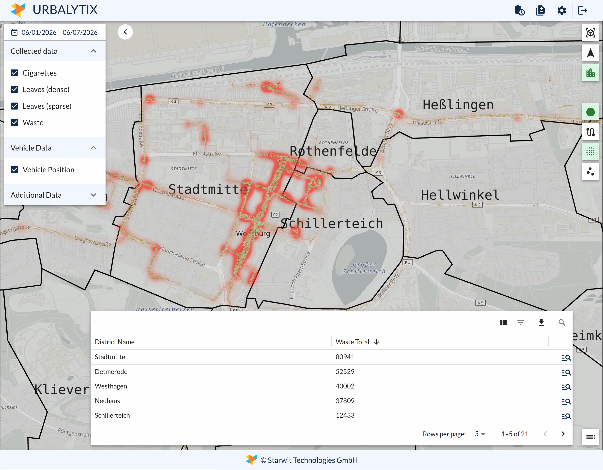
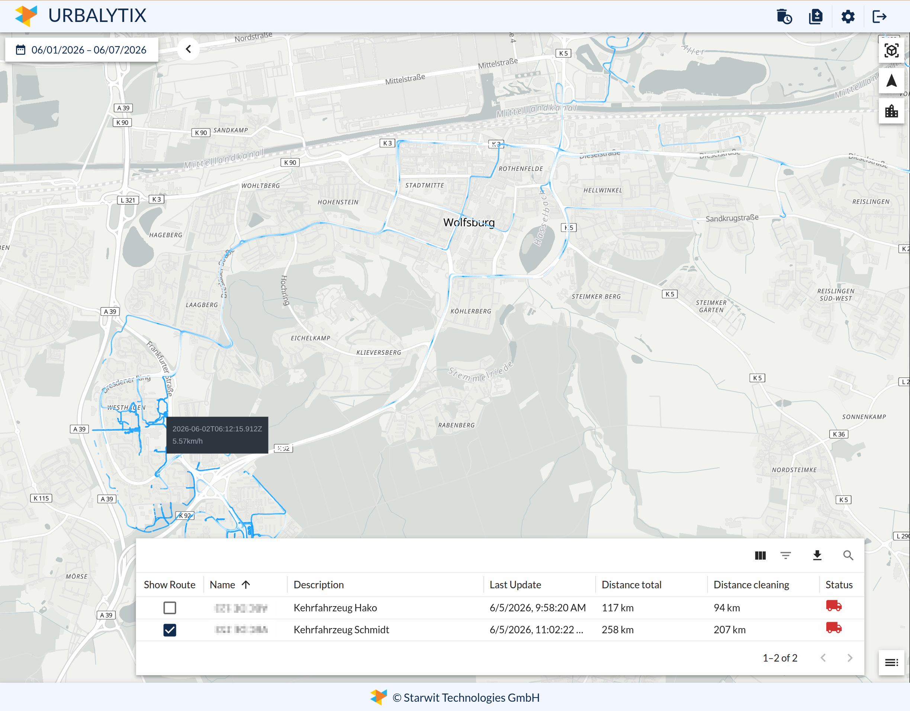
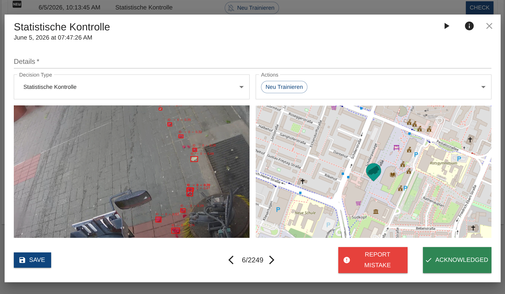

# Urbalytix
Urbalytix is a software product, that offers a number of functions, that help cities to run everyday business. Core features are measurement of waste type distribution in an area and the management of a service vehicle, fleet.

For a more detailed function overview see [Starwit's webpage](https://starwit-technologies.de/products/urbalytix/).

This software is open source and see section [license](#license--usage) how you can contribute.

## What does it do?
Next image shows an example of waste distribution data. Here all collected data from service vehicles is visualized. Urbalytix can display various types of waste and how their distribution changed over time.

Visualizing service vehicles routes is shown in the next image. It is easy to track which areas of a citey were serviced and also at which speed that happened.

Users can also test, if detection of waste is correct. The following screenshot shows an example for recorded and detected waste.

## How to install & use
Urbalytix is targeted to run on a Kubernetes cluster and ships with the necessary container and scripts. All necessary artifacts can be found on Docker hub [here](https://hub.docker.com/r/starwitorg/urbalytix) and [here](https://hub.docker.com/r/starwitorg/urbalytix-chart).

Refer to the [software's manual](docs/Readme-manual.md) for instructions how to install and use Urbalytix.

## How to develop
If you want to add functions to Urbalytix, [dev readme](docs/Readme-dev.md) contains all information you need to build & run the software.

## License & Usage

Project is licensed under AGPL 3 and the license can be found [here](LICENSE). This component is part of a publicly funded project by the city of Wolfsburg and thus usage in your community is very much encouraged. It is part of a group of software modules that shall help communities to analyze urban space and to gain statistical insights. 

More details on political and organizational background can be found here: https://www.wolfsburg.de/en-us/digital/smart-city

### Contribution

We are grateful for any contribution. Please refer to our [contribution guideline](CONTRIBUTING.md) and instructions document for any information.

